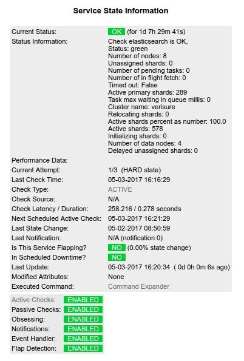

# Check elasticsearch

Simple script to query the [Elasticsearch](https://www.elastic.co/) cluster status, just using [Python](https://www.python.org/) [requests](http://docs.python-requests.org/en/master/), for [Icinga](https://www.icinga.com/).

Also uses [argparse](https://docs.python.org/3/library/argparse.html) for optional argument parsing.

## Pre-reqs:
```
pip install requests
```

## Howto

Define a new service in Icinga:
```
    define service{
        use                     generic-service
        service_description     Check Elasticsearch
        hostgroup_name          elasticsearch
        check_command           check_elasticsearch.py
    }
```

## Screenshot from Icinga



